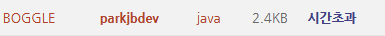
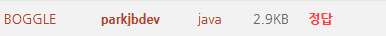

## [문제읽기](https://www.algospot.com/judge/problem/read/BOGGLE)

## 문제요약

 

BOGGLE 게임은 게임판의 한 글자에서 시작해서 펜을 떼지않고 이어서 영어단어를 찾아내는 게임

펜은 상화좌우, 대각선으로 이동할 수 있고, 글자를 건너뛸 수는 없음

단어들의 목록이 주어졌을 때 BOGGLE게임에서 단어를 찾을 수 있는지 여부를 출력하는 프로그램

## 풀이

가능한 경우를 모두 탐색해보아야 주어진 단어들이 BOGGLE 게임판에 존재하는지 확인할 수 있다.

예를 들어, 위의 게임판에서 PRETTY라는 단어를 찾기 위해서는 먼저 P 를 찾고, 그 주변(상하좌우, 대각선)에 그 다음 character R가 존재하는지 확인해보아야 한다. 이와 같은 과정을 계속하여 반복하면 주어진 단어가 존재하는지 확인할 수 있다.

즉, (a)의 게임판을 차례대로 순회하면서 P가 나올때까지 찾으면 U R L _**P**_ (gameBoard\[0\]\[3\]) 에서 character P를 찾고, P의 주변 에서 character _**R**_ (gameBoard\[1\]\[2\])를 찾고, 그 주변에서 또 character _**E**_ (gameBoard\[2\]\[3\])를 찾고 ... (계속)

위와 같은 과정을 반복하여 수행하기 위해서 재귀함수를 이용하여 코드를 작성하면 된다. 그렇게 작성한 코드는 다음과 같다.

### hasWord method (DP 사용X)

```java
public static boolean hasWord(Coordinate coordinate, String word, int index)
{
	if(!inRange(coordinate))	return false;
	if(gameBoard[coordinate.getX()][coordinate.getY()] != word.charAt(index))    return false;
	if(index + 1 == word.length())	return true;

	for (Coordinate delta : deltas)
	{
		Coordinate nextCoordinate = coordinate.add(delta);
		if(hasWord(nextCoordinate, word, index + 1)) return true;
	}
	return false;
}
```

 


하지만 위와 같이 오직 재귀로만 작성하면, 이미 순회한 부분을 반복해서 다시 순회하는 과정(overlapping subproblems)이 생길 수 있어 비효율적이다. 따라서 이미 순회한 부분은 단어가 완성되는지의 여부를 저장(memoization)해주면 같은 연산을 피할 수 있다.

따라서, 3차원 배열 cache를 두어, 특정 좌표 x, y에서 word의 index이후에 순회하였을 때, 단어가 완성되는지의 여부를 저장하였다.

즉, cache\[x\]\[y\]\[index\] = (gameBoard\[x\]\[y\] 좌표에서 word.subString(index)를 완성시킬수 있는지의 여부) 이다.

단어가 완성된다면 true, 완성시킬 수 없다면 false, 아직 순회한 적이 없다면 null로 저장해주었다. 코드는 다음과 같다.

### hasWord method (DP 사용O)


```java
public static boolean hasWord(Coordinate coordinate, String word, int index)
{
	if(!inRange(coordinate))	return false;
	if(gameBoard[coordinate.getX()][coordinate.getY()] != word.charAt(index))	return false;
	if(index + 1 == word.length())	return true;
	// return cached result
	if(cache[coordinate.getX()][coordinate.getY()][index] != null)
		return cache[coordinate.getX()][coordinate.getY()][index];

	for (Coordinate delta : deltas)
	{
		Coordinate nextCoordinate = coordinate.add(delta);
		if(hasWord(nextCoordinate, word, index + 1))
		{
			// cache result
			cache[coordinate.getX()][coordinate.getY()][index] = true;
			return true;
		}
	}
	// cache result
	cache[coordinate.getX()][coordinate.getY()][index] = false;
	return false;
}
```

 

## 코드 전문 - [Github 링크](https://github.com/parkjbdev/AlgoStudy/blob/master/APSS/CH06/BOGGLE/src/Main.java)